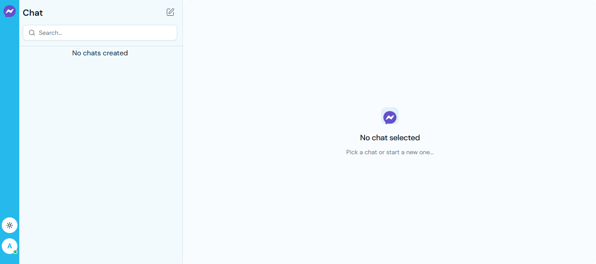

# Chat App

A modern, full-stack real-time chat application built with React, Node.js, Express, MongoDB, and Socket.IO, featuring one-on-one messaging, group chats, message replies, image sharing, typing indicators, and online presence tracking.


[](https://chatapp-client-theta.vercel.app/sign-in)



## Table of Contents

- [Live Demo](#live-demo)
- [Features](#features)
- [Tech Stack](#tech-stack)
- [Prerequisites](#prerequisites)
- [Installation](#installation)
- [Environment Variables](#environment-variables)
- [Running the Application](#running-the-application)
- [Project Structure](#project-structure)
- [API Documentation](#api-documentation)
- [WebSocket Events](#websocket-events)
- [Database Schema](#database-schema)
- [Contributing](#contributing)

## Live Demo

[Chat App](https://chatapp-client-theta.vercel.app/sign-in) - Try the live application

## Features

- **Real-time Messaging** - Instant message delivery powered by WebSocket (Socket.IO)
- **One-on-One Chats** - Private conversations with automatic duplicate prevention
- **Group Chats** - Multi-participant group conversations with custom group names
- **Message Replies** - Threaded replies for contextual conversations
- **Image Sharing** - Upload and share images via Cloudinary integration
- **Typing Indicators** - Real-time typing status notifications
- **Online Presence** - See which users are currently online
- **Soft Delete** - Messages are soft-deleted; images removed from cloud storage
- **Chat Management** - Create, view, and delete entire chats
- **User Search** - Filter chats by participant name or group name
- **Dark/Light Theme** - Toggle between light and dark modes
- **Responsive Design** - Mobile-first layout with adaptive UI
- **Optimistic UI** - Instant feedback with temporary "sending..." states
- **Secure Authentication** - JWT-based auth with HTTP-only cookies
- **Form Validation** - Client and server-side validation with Zod schemas

## Tech Stack

### Backend

| Technology            | Purpose                           |
| --------------------- | --------------------------------- |
| Node.js               | Runtime environment               |
| TypeScript            | Type-safe JavaScript              |
| Express.js v5         | Web framework                     |
| MongoDB + Mongoose v8 | Database and ODM                  |
| Socket.IO v4          | Real-time WebSocket communication |
| JWT + Passport.js     | Authentication                    |
| bcryptjs              | Password hashing                  |
| Zod                   | Schema validation                 |
| Cloudinary            | Image storage                     |
| Helmet, CORS          | Security middleware               |

### Frontend

| Technology       | Purpose                     |
| ---------------- | --------------------------- |
| React 19         | UI library                  |
| TypeScript       | Type safety                 |
| Vite v7          | Build tool and dev server   |
| React Router v7  | Client-side routing         |
| Zustand v5       | State management            |
| Axios            | HTTP client                 |
| Socket.IO Client | WebSocket client            |
| Tailwind CSS v4  | Utility-first CSS framework |
| shadcn/ui        | Accessible UI components    |
| Lucide React     | Icon library                |
| React Hook Form  | Form management             |
| Sonner           | Toast notifications         |
| next-themes      | Theme switching             |
| date-fns         | Date formatting             |

## Prerequisites

- **Node.js** (v18 or higher)
- **npm** or **yarn** package manager
- **MongoDB** (local or MongoDB Atlas)
- **Cloudinary** account (sign up at https://cloudinary.com)

## Installation

### 1. Clone the Repository

```bash
git clone <repository-url>
cd chat
```

### 2. Install Backend

```bash
cd backend
npm install
```

### 3. Install Frontend

```bash
cd ../frontend
npm install
```

## Environment Variables

### Backend

Create `.env` in `backend/`:

```env
PORT=5001
NODE_ENV=development

MONGO_URI=mongodb://localhost:27017/chat-app

JWT_SECRET=your-super-secret-jwt-key-change-this
JWT_EXPIRES_IN=7d

FRONTEND_ORIGIN=http://localhost:5173

CLOUDINARY_CLOUD_NAME=your-cloud-name
CLOUDINARY_API_KEY=your-api-key
CLOUDINARY_API_SECRET=your-api-secret
```

### Frontend

Create `.env` in `frontend/`:

```env
VITE_API_URL=http://localhost:5001/api/v1
```

## Running the Application

### Development Mode

**Terminal 1 - Backend:**

```bash
cd backend
npm run dev
```

Backend runs at `http://localhost:5001`.

**Terminal 2 - Frontend:**

```bash
cd frontend
npm run dev
```

Frontend runs at `http://localhost:5173`.

### Production Build

**Backend:**

```bash
cd backend
npm run build
npm start
```

**Frontend:**

```bash
cd frontend
npm run build
npm run preview
```

## Project Structure

```
chat/
├── backend/
│   ├── src/
│   │   ├── api/v1/           # API route handlers
│   │   │   ├── auth/          # Authentication
│   │   │   ├── chat/          # Chat CRUD
│   │   │   ├── message/       # Messages
│   │   │   └── user/          # Users
│   │   ├── config/           # Cloudinary & Passport
│   │   ├── db/               # Database
│   │   ├── lib/              # Business logic
│   │   ├── middleware/       # Express middleware
│   │   ├── model/            # Mongoose schemas
│   │   ├── routes/           # Router definitions
│   │   ├── utils/            # Utilities
│   │   ├── validator/         # Zod schemas
│   │   ├── app.ts            # Express app
│   │   └── index.ts          # Entry point
│   ├── package.json
│   └── tsconfig.json
│
├── frontend/
│   ├── src/
│   │   ├── components/       # React components
│   │   ├── hooks/            # Custom hooks
│   │   ├── layouts/          # Layouts
│   │   ├── lib/              # Utilities
│   │   ├── pages/            # Pages
│   │   ├── routes/           # Routing
│   │   ├── types/            # TypeScript types
│   │   ├── App.tsx           # Root
│   │   └── main.tsx          # Entry
│   ├── public/               # Static assets
│   ├── package.json
│   └── tsconfig.json
│
└── README.md
```

## API Documentation

All endpoints are prefixed with `/api/v1/`.

### Authentication

| Method | Endpoint         | Description       | Auth |
| ------ | ---------------- | ----------------- | ---- |
| POST   | `/auth/register` | Register new user | No   |
| POST   | `/auth/login`    | Login             | No   |
| POST   | `/auth/logout`   | Logout            | No   |
| GET    | `/auth/status`   | Check auth status | Yes  |

### Users

| Method | Endpoint         | Description    | Auth |
| ------ | ---------------- | -------------- | ---- |
| GET    | `/users`         | Get all users  | Yes  |
| PUT    | `/users/profile` | Update profile | Yes  |
| DELETE | `/users/account` | Delete account | Yes  |

### Chats

| Method | Endpoint         | Description       | Auth |
| ------ | ---------------- | ----------------- | ---- |
| POST   | `/chats`         | Create chat       | Yes  |
| GET    | `/chats`         | Get user chats    | Yes  |
| GET    | `/chats/:id`     | Get chat messages | Yes  |
| DELETE | `/chats/:chatId` | Delete chat       | Yes  |

### Messages

| Method | Endpoint               | Description    | Auth |
| ------ | ---------------------- | -------------- | ---- |
| POST   | `/messages`            | Send message   | Yes  |
| DELETE | `/messages/:messageId` | Delete message | Yes  |

### Health Check

| Method | Endpoint  | Description          |
| ------ | --------- | -------------------- |
| GET    | `/health` | Server health status |

## WebSocket Events

### Client → Server

| Event        | Payload              | Description     |
| ------------ | -------------------- | --------------- |
| `chat:join`  | `{ chatId: string }` | Join chat room  |
| `chat:leave` | `{ chatId: string }` | Leave chat room |
| `typing`     | `{ chatId: string }` | Start typing    |
| `stopTyping` | `{ chatId: string }` | Stop typing     |

### Server → Client

| Event             | Payload                   | Description          |
| ----------------- | ------------------------- | -------------------- |
| `online:users`    | `string[]`                | Online user IDs      |
| `chat:new`        | `Chat`                    | New chat created     |
| `chat:update`     | `{ chatId, lastMessage }` | New message in chat  |
| `chat:deleted`    | `{ chatId }`              | Chat deleted         |
| `message:new`     | `Message`                 | New message received |
| `message:deleted` | `{ chatId, messageId }`   | Message deleted      |
| `typing`          | `{ chatId, userId }`      | User typing          |
| `stopTyping`      | `{ chatId, userId }`      | User stopped typing  |

## Database Schema

### User

| Field     | Type     | Description       |
| --------- | -------- | ----------------- |
| \_id      | ObjectId | Unique ID         |
| name      | String   | Display name      |
| email     | String   | Email (unique)    |
| password  | String   | Hashed password   |
| avatar    | String   | Profile image URL |
| createdAt | Date     | Created timestamp |
| updatedAt | Date     | Updated timestamp |

### Chat

| Field        | Type       | Description       |
| ------------ | ---------- | ----------------- |
| \_id         | ObjectId   | Unique ID         |
| participants | ObjectId[] | User IDs          |
| lastMessage  | ObjectId   | Last message ref  |
| isGroup      | Boolean    | Group chat flag   |
| groupName    | String     | Group name        |
| createdBy    | ObjectId   | Creator user ID   |
| createdAt    | Date       | Created timestamp |
| updatedAt    | Date       | Updated timestamp |

### Message

| Field     | Type     | Description           |
| --------- | -------- | --------------------- |
| \_id      | ObjectId | Unique ID             |
| chatId    | ObjectId | Chat reference        |
| sender    | ObjectId | Sender user ID        |
| content   | String   | Message text          |
| image     | String   | Image URL             |
| replyTo   | ObjectId | Reply reference       |
| deletedAt | Date     | Soft delete timestamp |
| createdAt | Date     | Created timestamp     |
| updatedAt | Date     | Updated timestamp     |

## Contributing

1. Fork the repository
2. Create feature branch (`git checkout -b feature/name`)
3. Commit changes (`git commit -m 'Add feature'`)
4. Push branch (`git push origin feature/name`)
5. Open Pull Request
